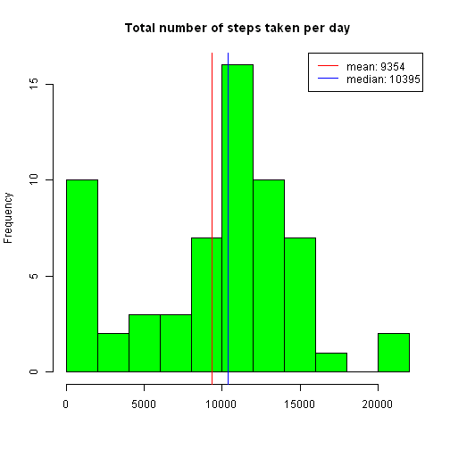
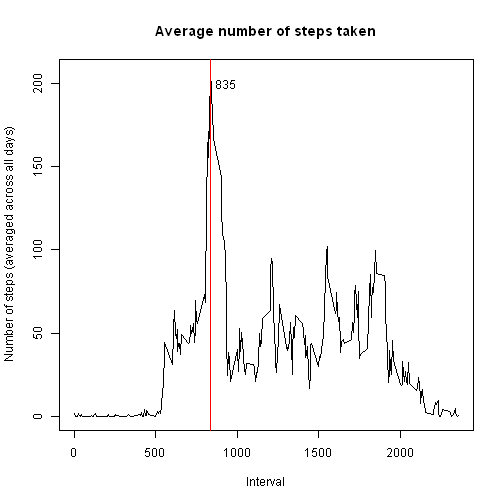
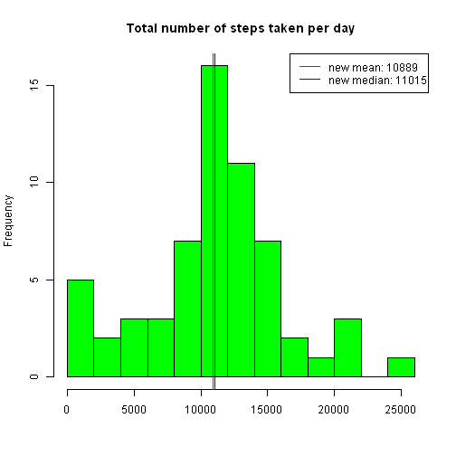
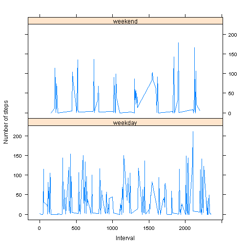

# Reproducible Research: Peer Assessment 1

```r

library(knitr)
library(plyr)
library(lattice)
```

### Loading and preprocessing the data
1. Download file from the Internet
2. Unzip the file into working directory
3. Read data into data frame
4. Convert the 'date' column into Date type

```r
# 1
download.file("https://d396qusza40orc.cloudfront.net/repdata%2Fdata%2Factivity.zip", 
    "../data/activity.zip")
```

```
## Error: unsupported URL scheme
```

```r
# 2
unzip("../data/activity.zip")
# 3
data <- read.csv("../data/activity.csv", stringsAsFactors = F)
names(data)
```

```
## [1] "steps"    "date"     "interval"
```

```r
sapply(data, class)
```

```
##       steps        date    interval 
##   "integer" "character"   "integer"
```

```r
# 4
data$date <- as.Date(data$date)
```

### What is mean total number of steps taken per day?
1. Split the data by date and calculate the mean total number of steps per day
2. Calculate the mean and median per day
3. Add the mean and median to the plot
4. Annotate the plot

```r
# 1
ttl.per.day <- sapply(split(data$steps, data$date), sum, na.rm = T)
hist(ttl.per.day, breaks = 10, col = "green", xlab = "", main = "Total number of steps taken per day")
# 2
mean.per.day <- as.integer(mean(ttl.per.day))
median.per.day <- median(ttl.per.day)
# 3
abline(v = mean.per.day, col = "red", lwd = 1)
abline(v = median.per.day, col = "blue", lwd = 1)
# 4
legend("topright", c(paste0("mean: ", mean.per.day), paste0("median: ", median.per.day)), 
    col = c("red", "blue"), lty = 1)
```

 

### What is the average daily activity pattern?
1. Split the data by the 5-minute interval and calculate the average number of steps taken per interval 
2. Make a time series plot
3. Add line to the plot corresponding to the interval that contains the maximum number of steps

```r
# 1
ave.across.day <- sapply(split(data$steps, data$interval), mean, na.rm = T)
interval <- unique(data$interval)
# 2
title <- "Average number of steps taken"
plot(interval, ave.across.day, type = "l", xlab = "Interval", ylab = "Number of steps (averaged across all days)", 
    main = title)
# 3
abline(v = interval[which.max(ave.across.day)], col = "red")
text(x = interval[which.max(ave.across.day)] + 100, y = 200, labels = interval[which.max(ave.across.day)])
```

 

### Imputing missing values
1. Calculate the total number of missing values in the dataset
2. Create a new data frame the same size as original that contains interval and average number of steps per the interval
3. Add column 'date'to the new data frame
4. Add column 'steps' with filled up missing values
5. Recreate a histogram of the total number of steps taken each day. Note that the median and mean differ from the previous histogram

```r
# 1
missing.values.count <- nrow(data[is.na(data$steps), ])
print(paste0("The total number of missing values is: ", missing.values.count))
```

```
## [1] "The total number of missing values is: 2304"
```

```r
# 2
newdata <- ddply(data, .(interval), summarise, ave = ave(steps, FUN = function(s) mean(s, 
    na.rm = TRUE)))
# 3
newdata$date <- data$date
# 4
newdata$steps <- ifelse(is.na(data$steps), newdata$ave, data$steps)
newdata <- newdata[, c("steps", "date", "interval")]
# 5
new.ttl.per.day <- tapply(newdata$steps, newdata$date, sum)
hist(new.ttl.per.day, breaks = 10, col = "green", xlab = "", main = "Total number of steps taken per day")
new.mean.per.day <- as.integer(mean(new.ttl.per.day))
abline(v = new.mean.per.day, col = "red", lwd = 1)
new.median.per.day <- median(new.ttl.per.day)
abline(v = new.median.per.day, col = "blue", lwd = 1)
legend("topright", c(paste0("new mean: ", new.mean.per.day), paste0("new median: ", 
    new.median.per.day)), col = c("red", "blue"), lty = 1)
```

 

### Are there differences in activity patterns between weekdays and weekends?
1. Create a new column that indicates whether a given date is a weekday or weekend day.
2. Calculate the average number of steps taken, averaged across all weekday days or weekend days
3. Make a panel plot of the average number of steps taken, averaged across all weekday days or weekend days.

```r
# 1
newdata$day <- as.factor(ifelse(weekdays(newdata$date) %in% c("Saturday", "Sunday"), 
    "weekend", "weekday"))
# 2
par(mfrow = c(2, 1))
ave.df <- ddply(newdata, .(interval), summarise, ave.across.day = ave(steps, 
    FUN = function(s) mean(s)))
newdata$ave.across.day = ave.df$ave.across.day
# 3
xyplot(ave.across.day ~ interval | day, data = newdata, type = "l", layout = c(1, 
    2), ylab = "Number of steps", xlab = "Interval")
```

 

